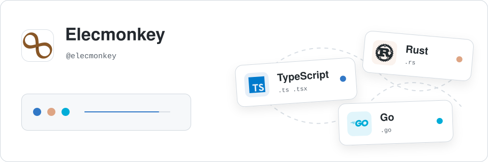

## Elecmonkey

Frontend engineer passionate about architecture and the JavaScript tooling ecosystem.

关注架构与 JavaScript 工具链的前端开发者。

- Blog: [Elecmonkey's Garden](https://www.elecmonkey.com/en) (English)
- 博客：[Elecmonkey的小花园](https://www.elecmonkey.com) (中文)

  

